 

&nbsp;
&nbsp;
&nbsp;

---

<h3 id="about"><code>~/about</code></h3>

 

&nbsp;

&nbsp;

  

&nbsp;

&nbsp;

  

<table>
<tr>
<td align="center" width="200"><b>ORG</b>  Zero Sleep Studio Co-founder</td>
<td align="center" width="200"><b>DAY JOB</b>  Fitelo Senior Video Editor</td>
<td align="center" width="200"><b>STATUS</b>  Online Open for collaboration</td>
</tr>
</table>

 

I craft **motion systems, brand identities, and visual stories** 
that turn ideas into cinematic experiences people remember.

---

<h3 id="toolkit"><code>~/toolkit</code></h3>

 

<h4>Motion &amp; VFX</h4>

<h4>Design</h4>

<h4>IDE &amp; Vibe Code</h4>

---

<h3 id="projects"><code>~/projects</code></h3>

 

<h4>Published</h4>

<table>
<tr>
<td align="center" width="220">
 

  
<a href="https://ommetrickz.vercel.app/"><b>OMMETRICKZ PORTFOLIO</b></a>
  
Cinematic motion design portfolio and project archive
  

  
</td>
<td align="center" width="220">
 

  
<a href="https://radarmed.vercel.app/"><b>RADARMED</b></a>
  
Public-data blood search ranked by match and distance
  

  
</td>
<td align="center" width="220">
 

  
<a href="https://github.com/ommetricksz/AFter_Effect_SC"><b>AE SCRIPTS</b></a>
  
After Effects ExtendScript toolkit for faster workflows
  

  
</td>
</tr>
</table>

 

<h4>Seeding</h4>

<table>
<tr>
<td align="center" width="220"><b>ZERO SLEEP STUDIO</b></td>
<td align="center" width="220"><b>CAREER AGENT</b></td>
<td align="center" width="220"><b>LAUNCH INDIA</b></td>
</tr>
</table>

---

<h3 id="connect"><code>~/connect</code></h3>

 

&nbsp;

&nbsp;

  

---

<code>// Built with intent. Chandigarh, India</code>

  

